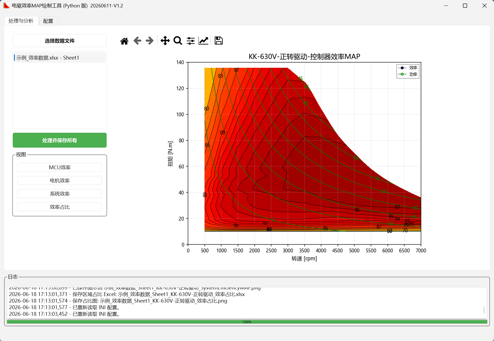
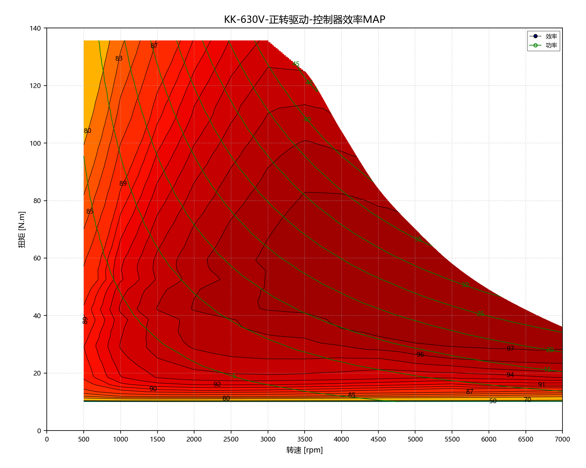

# MotorEffMAP

MotorEffMAP 是一个用于绘制电动汽车电机、电控、系统效率 MAP 的 Python 桌面工具。程序读取 Excel 测试数据，根据 `MotorEffMAP.ini` 中的列名和绘图参数，批量生成效率 MAP、功率等高线、效率区域占比表和占比图。

## 下载

- 项目仓库：[https://github.com/swordstudiox/MotorEffMAP](https://github.com/swordstudiox/MotorEffMAP)
- 编译版下载：[https://github.com/swordstudiox/MotorEffMAP/releases](https://github.com/swordstudiox/MotorEffMAP/releases)

普通用户建议从 Releases 下载编译版。开发者或需要二次修改时再使用源码运行。

## 主要功能

- 支持一次选择多个 Excel 文件。
- 支持自动遍历每个 Excel 文件中的多个 sheet。
- 支持 MCU、Motor、System 三类效率 MAP。
- 支持 MCU、Motor、System 三类转速-功率-效率 MAP。
- 支持 MCU、Motor、System 三类转速-扭矩-损耗 MAP，损耗单位为 W。
- 支持外特性曲线图，在同一图中显示转速-扭矩和转速-功率曲线。
- 支持功率等高线叠加显示。
- 支持效率区域占比计算，并导出 Excel 和 PNG。
- 支持在界面中编辑 `MotorEffMAP.ini` 配置。
- 支持源码运行和 Windows 编译版运行。

## 目录结构

| 文件或目录 | 说明 |
| --- | --- |
| `run.py` | 源码运行入口。 |
| `MotorEffMAP_GUI.py` | 兼容旧导入的 GUI 入口，实际实现位于 `motor_eff_map/gui/`。 |
| `MotorEffMAP_Logic.py` | 兼容旧导入的逻辑入口，实际实现位于 `motor_eff_map/logic/`。 |
| `motor_eff_map/gui/main_window.py` | PySide6 主窗口布局、配置刷新和轻量协调辅助。 |
| `motor_eff_map/gui/config_schema.py` | GUI 配置标签、输出开关、效率输出定义和图形布局常量。 |
| `motor_eff_map/gui/widgets.py` | 日志控件、固定比例画布容器和页脚签名控件。 |
| `motor_eff_map/gui/config_editor.py` | INI 配置读取、默认值补齐、配置控件创建和写回。 |
| `motor_eff_map/gui/plot_helpers.py` | Matplotlib 布局、等高线、坐标刻度和图像缓存辅助。 |
| `motor_eff_map/gui/output_naming.py` | 输出文件名清洗和输出文件名前缀生成。 |
| `motor_eff_map/gui/processing_controller.py` | 文件选择、批量处理、单个 sheet 处理和运行状态编排。 |
| `motor_eff_map/gui/batch_worker.py` | 批处理后台 worker 和无 Qt 控件依赖的批量导出上下文。 |
| `motor_eff_map/gui/plotters/` | 按图类型拆分的效率 MAP、转速-功率 MAP、损耗 MAP、外特性和占比图绘制。 |
| `motor_eff_map/logic/motor_eff_logic.py` | 数据读取、清洗、包络线、插值、损耗和占比计算主逻辑。 |
| `motor_eff_map/logic/config_values.py` | 逻辑层配置值解析辅助。 |
| `motor_eff_map/logic/interpolation.py` | 插值点校验和起始区域裁剪辅助。 |
| `MotorEffMAP.ini` | 用户配置文件。 |
| `requirements.txt` | 源码运行依赖。 |
| `requirements-build.txt` | 构建可执行文件所需的 PyInstaller 依赖。 |
| `build_exe.bat` | Windows 一键打包脚本。 |
| `build_script.py` | PyInstaller 打包逻辑。 |
| `example/` | 示例数据和示例输出图片，可用于快速试运行和查看效果。 |
| `docs/program-implementation.md` | 详细程序实现文档，供维护者和程序读取。 |
| `docs/program-implementation.html` | 与 Markdown 同步的离线 HTML 文档，供用户查看。 |

## 编译版怎么运行

1. 打开 [Releases](https://github.com/swordstudiox/MotorEffMAP/releases)。
2. 下载最新发布包。
3. 解压到本地目录。
4. 确认目录中至少包含：

```text
MotorEffMAP.exe
MotorEffMAP.ini
```

5. 双击 `MotorEffMAP.exe`。
6. 在程序中点击 `选择数据文件`，选择 `.xls` 或 `.xlsx`。
7. 点击 `处理并保存所有`。

编译版会从 `MotorEffMAP.exe` 同级目录读取 `MotorEffMAP.ini`。如果要给不同项目使用不同配置，可以复制整个程序目录，再分别修改各目录下的 `MotorEffMAP.ini`。

## 源码怎么运行

### 1. 准备 Python

建议使用 Python 3.11 或更新版本。

### 2. 克隆仓库

```bash
git clone https://github.com/swordstudiox/MotorEffMAP.git
cd MotorEffMAP
```

### 3. 创建虚拟环境

Windows PowerShell：

```powershell
python -m venv venv
.\venv\Scripts\Activate.ps1
```

Windows CMD：

```bat
python -m venv venv
venv\Scripts\activate.bat
```

### 4. 安装依赖

```bash
pip install -r requirements.txt
```

### 5. 启动程序

```bash
python run.py
```

源码运行时，程序会读取项目根目录下的 `MotorEffMAP.ini`。

## 程序界面



## 示例数据

仓库中的 `example/` 目录提供了一组可直接试用的示例文件：

| 文件 | 说明 |
| --- | --- |
| `example/MotorEffMAP_主界面.png` | 程序主界面截图。 |
| `example/示例_效率数据.xlsx` | 示例输入数据，可在程序中直接选择并处理。 |
| `example/示例_效率数据_Sheet1_KK-630V-正转驱动_MCUEfficiencyMAP.png` | 示例生成的 MCU 效率 MAP。 |
| `example/示例_效率数据_Sheet1_KK-630V-正转驱动_效率占比.xlsx` | 示例生成的效率区域占比表。 |
| `example/示例_效率数据_Sheet1_KK-630V-正转驱动_效率占比.png` | 示例生成的效率区域占比图。 |

示例图片使用仓库内相对路径引用，在 GitHub 等远程 Git 仓库页面中可以直接显示。

## 示例效果



## Excel 数据要求

程序会读取 Excel 中的所有 sheet。每个 sheet 的第一行应作为列名，列名要和 `MotorEffMAP.ini` 中配置一致。

建议数据格式：

| 类型 | 要求 |
| --- | --- |
| 转速 | 数字，可正可负，程序会取绝对值用于 MAP。 |
| 扭矩 | 数字，可正可负，程序会取绝对值用于 MAP。 |
| 功率 | 数字，可正可负，程序会取绝对值用于 MAP。 |
| MCU 效率 | 数字，建议 0 到 100 之间。 |
| 电机效率 | 数字，建议 0 到 100 之间。 |
| 系统效率 | 数字，建议 0 到 100 之间。 |
| 母线电压 | 数字，或在 `customUdc` 中直接配置固定电压。 |

注意事项：

- Excel 末尾可以有空行，程序会删除无效空行。
- 如果某列存在但某些单元格为空，空值不会被当成 0。
- 如果配置中写的列名在 Excel 中不存在，程序会提示错误并停止处理该 sheet。
- 同一个 sheet 建议只放同一转向、同一电动/发电状态、同一电压等级的数据。

## 配置文件说明

配置文件是 `MotorEffMAP.ini`。可以直接编辑，也可以在程序的 `配置` 页签中修改后点击 `保存并重载`。

### 基本信息

| 配置项 | 说明 | 示例 |
| --- | --- | --- |
| `VehicleCode` | 车型、项目或样件代号，会出现在标题和输出文件名中。 | `KK` |
| `customSpeedDirection` | 自定义转向名称。留空时由转速均值自动判断；填写后覆盖自动判断结果。 | `正转` |
| `customMotionState` | 自定义工况状态。留空时由功率均值自动判断；填写后覆盖自动判断结果。 | `驱动` |

### Excel 列名映射

这些配置项右侧必须填写 Excel 第一行中真实存在的列名。

| 配置项 | 说明 |
| --- | --- |
| `Speed` | 转速列名。 |
| `Torque` | 扭矩列名。 |
| `P_Motor` | 电机功率列名。 |
| `Eff_MCU` | 控制器效率列名。 |
| `Eff_Motor` | 电机效率列名。 |
| `Eff_SYS` | 系统效率列名。 |
| `U_dc` | 母线电压列名。 |
| `customUdc` | 固定电压值。填写有效数字后，程序优先使用该电压，不再使用 `U_dc` 列。 |

示例：

```ini
VehicleCode = KK
Speed = 转速[rpm]
Torque = 扭矩[Nm]
P_Motor = 功率[kW]
Eff_MCU = 效1
Eff_Motor = 效2
Eff_SYS = 效3
U_dc = Udc4
customUdc =
```

### MAP 输出开关

| 配置项 | 说明 |
| --- | --- |
| `MCUMAP` | `1` 输出控制器效率 MAP，`0` 不输出。 |
| `MotorMAP` | `1` 输出电机效率 MAP，`0` 不输出。 |
| `SYSMAP` | `1` 输出系统效率 MAP，`0` 不输出。 |
| `MCUAreaRatioCalculation` | `1` 计算控制器效率区域占比。 |
| `MotorAreaRatioCalculation` | `1` 计算电机效率区域占比。 |
| `SYSAreaRatioCalculation` | `1` 计算系统效率区域占比。 |
| `SpeedPowerMAP` | `1` 输出转速-功率-效率 MAP，`0` 不输出。 |
| `LossMAP` | `1` 输出转速-扭矩-损耗 MAP，`0` 不输出。 |
| `ExternalCharacteristicPlot` | `1` 输出外特性曲线图，`0` 不输出。 |

### 绘图和网格参数

| 配置项 | 说明 | 示例 |
| --- | --- | --- |
| `EffMAPStep` | 效率等高线和占比阈值，支持英文逗号、分号或空格分隔。 | `80,85,90,95,99` |
| `PowerMAPStep` | 功率等高线值，支持英文逗号、分号或空格分隔。 | `5,10,15,20,25` |
| `LossMAPStep` | 损耗等高线值，单位 W；留空时自动生成。 | `500,1000,1500` |
| `xstepSpeed` | 转速轴刻度间隔，单位 rpm。 | `500` |
| `ystepTorque` | 扭矩轴刻度间隔，单位 N.m。 | `20` |
| `ystepPower` | 功率轴刻度间隔，单位 kW。 | `10` |
| `StartSpeed` | 效率区域占比起始转速。默认从 `0rpm` 开始。 | `0` |
| `StartTorque` | 效率区域占比起始扭矩。默认从 `0Nm` 开始。 | `0` |
| `StartPower` | 转速-功率-效率 MAP 的起始功率，单位 kW；留空时按 `StartSpeed * StartTorque / 9550` 自动换算。 | `` |
| `SpeedGrid` | 插值网格转速步长，必须大于 0。越小越精细，但越慢。 | `5` |
| `TorqueGrid` | 插值网格扭矩步长，必须大于 0。越小越精细，但越慢。 | `0.5` |
| `MaxGridPoints` | 最大网格点数安全上限，限制 `网格行数 x 网格列数`，防止步长过小导致内存过大。 | `5000000` |

效率区域占比分母按几何运行区域计算。默认 `StartSpeed=0`、`StartTorque=0` 时，从 `0rpm / 0Nm` 开始统计。

转速-扭矩效率 MAP 和损耗 MAP 使用 `xstepSpeed` / `ystepTorque` 设置坐标刻度；转速-功率-效率 MAP 使用 `xstepSpeed` / `ystepPower` 设置坐标刻度。

转速-功率-效率 MAP 使用转速-扭矩效率网格换算得到，功率坐标按 `功率(kW) = 转速(rpm) * 扭矩(Nm) / 9550` 计算，分辨率由 `SpeedGrid` 和 `TorqueGrid` 决定。该图继承转速-扭矩效率 MAP 的有限插值区域，不会用最近邻补齐扭矩图中原本没有可靠效率值的区域。该图使用 `StartSpeed` 和 `StartPower` 截止；`StartPower` 留空时，程序会按 `StartSpeed * StartTorque / 9550` 自动换算为 kW；如果填写了 `StartPower`，则优先使用填写值。

损耗 MAP 按下式自动计算：

```text
损耗 W = P_Motor(kW) * 1000 * (100 / 效率% - 1)
```

效率为空、为 0 或大于等于 100 的点不会参与损耗插值。

## 使用流程

1. 准备 Excel 数据，确认第一行列名正确。
2. 打开程序。
3. 切换到 `配置` 页，检查列名映射和绘图参数。
4. 点击 `保存并重载`。
5. 回到 `处理与分析` 页。
6. 点击 `选择数据文件`。
7. 点击 `处理并保存所有`。
8. 在程序目录查看输出的 PNG、XLSX 和日志文件。

## 输出文件

输出文件会保存在当前运行目录。文件名包含源文件名、sheet 名、车型、电压、转向、状态和输出类型，以避免批量处理时互相覆盖。

示例：

```text
示例数据_Sheet1_车型A-500V-正转驱动_控制器EfficiencyMAP.png
示例数据_Sheet1_车型A-500V-正转驱动_电机EfficiencyMAP.png
示例数据_Sheet1_车型A-500V-正转驱动_系统EfficiencyMAP.png
示例数据_Sheet1_车型A-500V-正转驱动_控制器SpeedPowerEfficiencyMAP.png
示例数据_Sheet1_车型A-500V-正转驱动_控制器LossMAP.png
示例数据_Sheet1_车型A-500V-正转驱动_外特性曲线.png
示例数据_Sheet1_车型A-500V-正转驱动_效率占比.xlsx
示例数据_Sheet1_车型A-500V-正转驱动_效率占比.png
```

## 怎么自行编译

Windows 下可以直接运行：

```bat
build_exe.bat
```

首次构建前请安装源码和构建依赖：

```bash
pip install -r requirements.txt
pip install -r requirements-build.txt
```

或在已安装依赖的 Python 环境中运行：

```bash
python build_script.py
```

构建脚本会：

1. 强制使用项目虚拟环境 `venv\Scripts\python.exe`。
2. 检查 `pyinstaller`，缺失时提示先安装 `requirements-build.txt`，不会在构建过程中隐式联网安装。
3. 直接使用已有 `MotorEffMAP.ico`，不再转换图标。
4. 清理旧的 `build/`、`dist/` 和 `MotorEffMAP.spec`。
5. 使用 PyInstaller 打包。
6. 根据 `version.ini` 将发布目录命名为 `MotorEffMAP_日期-版本号`。
7. 复制 `MotorEffMAP.ini`、`version.ini` 和 `MotorEffMAP.ico` 到发布目录。
8. 清理当前程序不用的 Qt 资源并检查构建产物完整性。

构建完成后，可执行文件目录为：

```text
dist/MotorEffMAP_20260611-V1.2/
```

进入该目录双击 `MotorEffMAP.exe` 即可运行。

## 常见问题

### 1. 提示找不到列

检查 `MotorEffMAP.ini` 中的列名是否和 Excel 第一行完全一致，包括空格、括号、单位和中英文符号。

### 2. 图为空或没有输出

常见原因：

- 配置列名不正确。
- Excel 中对应列无法转换为数字。
- 效率值不在 `[0, 100)` 范围内，被过滤掉。
- `SpeedGrid` 或 `TorqueGrid` 配置不合法。

### 3. 提示网格过大

说明 `SpeedGrid` 或 `TorqueGrid` 太小，导致插值网格数量过大。可以适当增大步长，例如把 `SpeedGrid` 从 `1` 改为 `5`，或把 `TorqueGrid` 从 `0.1` 改为 `0.5`。

### 4. 编译版改配置后没有生效

确认修改的是 `MotorEffMAP.exe` 同级目录下的 `MotorEffMAP.ini`。修改后在程序中点击 `保存并重载`，或重启程序。

### 5. 中文乱码

配置文件可能是 GB18030/ANSI 编码。建议优先在程序的 `配置` 页修改配置；如果用外部编辑器，请使用支持 UTF-8 和 GB18030 的编辑器，并避免强制改错编码。

## 详细实现文档

- Markdown 源文档：[`docs/program-implementation.md`](docs/program-implementation.md)
- 离线 HTML 文档：[`docs/program-implementation.html`](docs/program-implementation.html)

如果修改了程序实现或配置字段，请同步更新 README 和这两个实现文档。

## 许可证

本项目使用仓库中的 [`LICENSE`](LICENSE) 文件声明的许可证。
