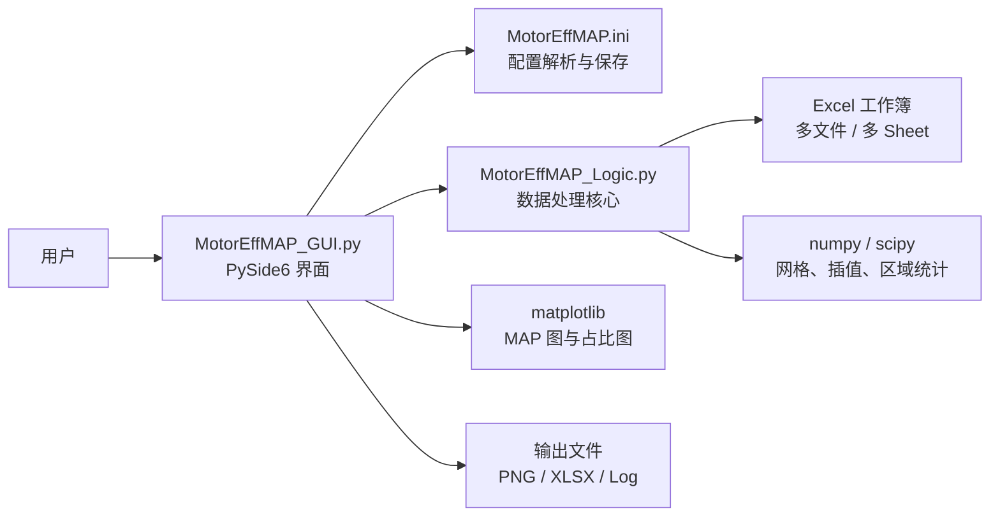
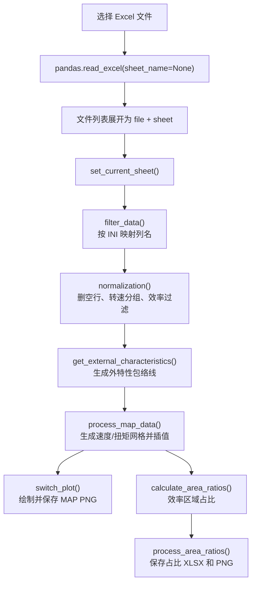

# MotorEffMAP 程序实现文档

> 本文档面向维护者、二次开发者和自动化程序读取。HTML 同步版为 `docs/program-implementation.html`，用于用户离线浏览。

## 1. 项目定位

MotorEffMAP 是一个用于绘制电驱系统效率 MAP 的 Python 桌面程序。用户通过 Excel 导入电机/电控测试数据，通过 `MotorEffMAP.ini` 配置列名和绘图参数，程序批量输出：

- MCU / 控制器效率 MAP 图。
- 电机效率 MAP 图。
- 系统效率 MAP 图。
- 效率区域占比 Excel。
- 效率区域占比曲线图。

程序当前采用 PySide6 构建 GUI，使用 pandas 读取 Excel，使用 scipy 和 numpy 做插值、网格生成与区域统计，使用 matplotlib 绘图。

## 2. 文件结构

| 路径 | 责任 |
| --- | --- |
| `run.py` | 应用入口，创建 `QApplication`，设置图标、字体和 matplotlib 字体，再显示主窗口。 |
| `MotorEffMAP_GUI.py` | GUI 主体、配置页、文件选择、批量处理、绘图显示、保存输出和错误提示。 |
| `MotorEffMAP_Logic.py` | 数据读取、列映射、清洗、归一化、包络线、插值网格、效率区域占比计算。 |
| `MotorEffMAP.ini` | 用户配置文件。源码运行时放在项目根目录；编译版运行时放在 exe 同级目录。 |
| `requirements.txt` | 源码运行依赖。 |
| `build_script.py` | PyInstaller 打包脚本，生成 `dist/MotorEffMAP/MotorEffMAP.exe` 并复制配置文件。 |
| `build_exe.bat` | Windows 一键打包入口，自动调用 `build_script.py`。 |
| `MotorEffMAP.ico` / `图标.png` | 程序图标资源。 |
| `README.md` | 用户快速上手、下载、配置、运行和打包说明。 |

## 3. 总体架构



架构边界比较清晰：

- GUI 负责用户操作、配置编辑、进度、日志、可视化和文件保存。
- 逻辑层只负责从 DataFrame 到计算结果的转换，不直接操作 GUI 控件。
- 配置文件是用户可编辑接口，GUI 和逻辑层都通过配置字典读取参数。
- 打包脚本只负责构建和复制运行所需资源，不参与运行时计算。

## 4. 运行时数据流



处理流程由 `MainWindow.run_process_all()` 启动。程序会遍历用户选择的所有 Excel 文件，再遍历每个工作簿的所有 sheet。每个 sheet 都会按同一套配置处理。

## 5. GUI 层实现

### 5.1 主窗口

`MainWindow` 继承 `QMainWindow`，初始化时完成：

- 判断配置文件路径：
  - 源码运行：`run.py` 所在目录。
  - 编译版运行：`MotorEffMAP.exe` 所在目录。
- 初始化两个页签：
  - `处理与分析`：文件列表、批量处理按钮、视图切换按钮和绘图区。
  - `配置`：按 `MotorEffMAP.ini` 动态生成表单。
- 初始化日志区域和进度条。
- 调用 `reload_config()` 加载配置并创建 `MotorEffLogic`。

### 5.2 处理页

处理页左侧是操作区，右侧是绘图区：

| 控件 | 行为 |
| --- | --- |
| `选择数据文件` | 打开文件选择框，支持 `.xls` / `.xlsx`。 |
| 文件列表 | 每个 Excel 的每个 sheet 会展开成一个条目。 |
| `处理并保存所有` | 批量处理文件列表中所有条目。 |
| `MCU效率` / `电机效率` / `系统效率` | 对当前数据切换显示对应 MAP。 |
| `效率占比` | 对当前数据绘制效率区域占比曲线。 |

绘图区使用 `FigureCanvasQTAgg`，外层包裹 `AspectRatioWidget`，将屏幕显示保持在接近 25cm x 20cm 的长宽比例。

### 5.3 配置页

配置页读取 `MotorEffMAP.ini` 后动态生成 `QLineEdit` 表单。保存时：

1. 收集每个输入框的值。
2. 调用 `write_ini_file()` 写回配置。
3. 重新加载配置，让逻辑层立即使用新参数。

配置解析兼容两种形式：

- 没有 section 的传统 INI：程序会临时补 `[DEFAULT]` 再解析。
- 有 section 的标准 INI：按 section 读取，最终扁平化成配置字典。

编码读取顺序是：

1. 优先 UTF-8。
2. UTF-8 失败后尝试 GB18030。

保存时使用当前读取到的编码，避免中文配置在 Windows 上被破坏。

### 5.4 错误处理

GUI 层通过 `handle_processing_error()` 统一处理可预期的处理错误：

- 写入日志。
- 将进度条归零。
- 弹出 `QMessageBox.warning()`。
- 停止后续输出，避免生成半成品。

典型错误包括：

- Excel 缺失必要列。
- `SpeedGrid` 或 `TorqueGrid` 不是大于 0 的数字。
- 外特性包络线不可用。
- 网格规模超过安全上限。

## 6. 配置文件实现

`MotorEffMAP.ini` 是程序的主要用户接口。当前核心配置如下。

| 配置项 | 用途 | 示例 |
| --- | --- | --- |
| `VehicleCode` | 车型或项目代号，用于图标题和输出文件名。 | `KK` |
| `Speed` | Excel 中转速列名。 | `转速[rpm]` |
| `Toqrue` | Excel 中扭矩列名。注意该键名沿用历史拼写。 | `扭矩[Nm]` |
| `P_Motor` | Excel 中电机功率列名。 | `功率[kW]` |
| `Eff_MCU` | Excel 中控制器效率列名。 | `效1` |
| `Eff_Motor` | Excel 中电机效率列名。 | `效2` |
| `Eff_SYS` | Excel 中系统效率列名。 | `效3` |
| `U_dc` | Excel 中母线电压列名。 | `Udc4` |
| `customUdc` | 固定电压值。填写后优先使用该值，不再使用 `U_dc` 列。 | `530` |
| `MCUMAP` | 是否输出 MCU 效率 MAP。`1` 输出，`0` 不输出。 | `1` |
| `MotorMAP` | 是否输出电机效率 MAP。 | `1` |
| `SYSMAP` | 是否输出系统效率 MAP。 | `1` |
| `MCUAreaRatioCalculation` | 是否计算 MCU 效率区域占比。 | `1` |
| `MotorAreaRatioCalculation` | 是否计算电机效率区域占比。 | `1` |
| `SYSAreaRatioCalculation` | 是否计算系统效率区域占比。 | `1` |
| `EffMAPStep` | 效率等高线和占比阈值。支持逗号、分号或空格分隔。 | `80,85,90,95,99` |
| `PowerMAPStep` | 功率等高线值。 | `5,10,15,20` |
| `xstep` | 图中转速轴刻度间隔。 | `500` |
| `ystep` | 图中扭矩轴刻度间隔。 | `20` |
| `StartSpeed` | 效率区域统计起始转速。低于该值的区域屏蔽。 | `0` |
| `StartTorque` | 效率区域统计起始扭矩。低于该值的区域屏蔽。 | `0` |
| `SpeedGrid` | 插值网格的转速步长，必须大于 0。 | `5` |
| `TorqueGrid` | 插值网格的扭矩步长，必须大于 0。 | `0.5` |
| `MaxGridPoints` | 最大网格点数安全上限，限制 `网格行数 x 网格列数`，防止步长过小导致内存过大。 | `5000000` |
| `customSpeedDirection` | 自定义转向名称。留空时由转速均值自动判断；填写后覆盖自动判断结果。 | `正转` |
| `customMotionState` | 自定义工况状态。留空时由功率均值自动判断；填写后覆盖自动判断结果。 | `驱动` |

## 7. 输入 Excel 要求

程序使用 `pandas.read_excel(file_path, sheet_name=None)` 读取所有 sheet。每个 sheet 的第一行会作为列名。

输入数据建议满足：

- 第一行是列名，并且列名与 `MotorEffMAP.ini` 中配置完全一致。
- 转速、扭矩、功率、效率、电压列应能转换为数字。
- 可以存在空行，程序会在归一化阶段删除核心列为空的数据。
- 可以存在单位行或文本行，只要核心列无法转成数字，就会变成 NaN 并被删除。
- 同一 sheet 建议只包含同一转向、同一电动/发电状态、同一电压等级的数据。

必需列包括：

- `Speed`
- `Toqrue`
- `P_Motor`
- `Eff_MCU`
- `Eff_Motor`
- `Eff_SYS`
- `U_dc`，除非填写了有效的 `customUdc`

缺失必需列时，程序会明确失败，不再用全 0 数据代替。

## 8. 逻辑层实现

### 8.1 数据加载

`MotorEffLogic.load_data()` 负责读取 Excel：

```python
self.sheets_dict = pd.read_excel(file_path, sheet_name=None)
```

返回结构是 `{sheet_name: DataFrame}`。GUI 会把每个 sheet 加入文件列表，处理时通过 `set_current_sheet(sheet_name)` 切换当前 DataFrame。

### 8.2 列映射和基础判断

`filter_data()` 根据配置读取列：

- 先去掉 Excel 列名首尾空格。
- 用 `pd.to_numeric(..., errors='coerce')` 将配置列转换为数字。
- 保留 NaN，不把空值填成 0。
- 对转速、扭矩、功率取绝对值。
- 效率和电压保留数值化结果。

方向和状态判断使用取绝对值之前的原始列均值：

| 判断项 | 规则 |
| --- | --- |
| 转向 | 转速均值 `> 0` 为 `正转`，否则为 `反转`。 |
| 状态 | 功率均值 `> 0` 为 `电动`，否则为 `发电`。 |

`customUdc` 有优先级：如果配置中填写了可转成数字的 `customUdc`，程序会创建同长度的常数电压序列；否则从 `U_dc` 列读取。

### 8.3 归一化

`normalization()` 做四件事：

1. 删除核心列中存在 NaN 的行。
2. 按转速排序。
3. 将相邻差值不超过 6 rpm 的转速合并为同一个平均转速。
4. 按转速和扭矩排序。
5. 过滤效率值，只保留 `[0, 100)` 范围内的数据。

该步骤会把结果写回 `self.processed_df`，后续包络线、插值和绘图都使用清洗后的数据。

### 8.4 外特性包络线

`get_external_characteristics()` 按转速分组，取每个转速下的最大扭矩，得到外特性点：

```python
max_curve = df.groupby('Speed')['Torque'].max().reset_index()
```

包络线插值策略：

| 外特性点数量 | 策略 |
| --- | --- |
| 0 | 包络线不可用，返回空结果。 |
| 1 | 使用常数扭矩曲线。 |
| 2 | 使用线性插值。 |
| 大于 2 | 使用 `PchipInterpolator` 保形插值。 |

插值结果会被限制在 `[0, 观测最大扭矩 * 1.05]`，防止平滑过冲导致网格异常变大。

### 8.5 网格和插值

`process_map_data(eff_type)` 生成用于绘图和统计的二维网格。

转速轴：

```python
n_speed_steps = int(max_speed / SpeedGrid) + 1
xi_speed_axis = np.linspace(0, max_speed, n_speed_steps)
```

扭矩轴不是全矩形，而是按每个转速列生成：

1. 用外特性包络线计算当前转速的最大扭矩。
2. 从 `0` 到当前最大扭矩按 `TorqueGrid` 生成扭矩点。
3. 如果最后一点不是包络线边界，则额外追加边界点。
4. 用 NaN 填充不同列之间的长度差。

插值使用 scipy：

```python
ZI_Eff = griddata(points, eff_values, (XI_valid, YI_valid), method='linear')
ZI_Power = griddata(points, power_values, (XI_valid, YI_valid), method='linear')
```

`StartSpeed` 和 `StartTorque` 会生成截止掩码：

```python
cutoff_mask = (XI < StartSpeed) | (YI < StartTorque)
```

被截止的效率和功率会设为 NaN。

返回值是：

```python
XI, YI, ZI_Power, ZI_Eff, mask_valid_geo
```

其中 `mask_valid_geo` 表示外特性几何区域内、且不在起始转速/起始扭矩截止区内的点。

### 8.6 效率区域占比

`calculate_area_ratios(z_eff, geo_mask)` 根据 `EffMAPStep` 计算各效率阈值的面积占比。

分母规则：

- 如果提供 `geo_mask`，分母使用几何区域总点数。
- 如果没有 `geo_mask`，分母使用 `z_eff` 中非 NaN 点数。

当前 GUI 使用 `process_map_data()` 返回的 `mask_valid_geo`，因此效率区域占比的分母从配置的几何运行区域开始计算。默认 `StartSpeed=0`、`StartTorque=0` 时，即从 `0rpm / 0Nm` 开始。

分子规则：

- 对每个效率阈值，统计 `z_eff >= level` 的点数。
- NaN 不会计入分子。

公式：

```text
Ratio(level) = count(z_eff >= level) / count(geo_mask) * 100
```

## 9. 绘图实现

### 9.1 MAP 图

`switch_plot(eff_type_short, save_png=False)` 负责绘制 MCU、电机或系统效率 MAP。

绘图内容：

- 效率填色等高线：`contourf(..., cmap='jet')`
- 效率等高线标签：黑色线条。
- 功率等高线标签：绿色线条。
- 轴标签：
  - X：`转速 [rpm]`
  - Y：`扭矩 [N.m]`
- 标题格式：
  - `{VehicleCode}-{电压}V-{转向}{状态}-{MAP名称}`

状态命名规则：

- 逻辑层返回 `电动` 时，图和文件名中显示为 `驱动`。
- 逻辑层返回 `发电` 时，保持 `发电`。

保存图片时，程序临时设置图像尺寸约为 25cm x 20cm，DPI 为 200，保存后恢复 GUI 显示尺寸。

### 9.2 效率区域占比图

`process_area_ratios()` 会同时保存 Excel 和 PNG。`show_ratio_plot()` 只负责在 GUI 中显示当前数据的占比图。

占比图内容：

- X 轴：效率阈值，范围 80 到 100。
- Y 轴：效率区域占比，范围 0 到 100。
- MCU：蓝色星标线。
- 电机：绿色圆点线。
- 系统：洋红色加号线。

## 10. 输出文件

输出文件名由 `build_output_stem()` 构造，包含：

- 源 Excel 文件名。
- sheet 名称。
- `VehicleCode`。
- 平均电压。
- 转向。
- 状态。
- 输出类型。

示例：

```text
示例数据_Sheet1_车型A-500V-正转驱动_MCUEfficiencyMAP.png
示例数据_Sheet1_车型A-500V-正转驱动_效率占比.xlsx
示例数据_Sheet1_车型A-500V-正转驱动_效率占比.png
```

文件名会做清理：

- 保留中文、字母、数字、下划线、点和短横线。
- 其他字符替换为下划线。
- 连续下划线会折叠。

## 11. 编译版实现

打包入口有两个：

```text
build_exe.bat
build_script.py
```

`build_exe.bat` 负责：

1. 切换到脚本所在目录。
2. 如果存在 `venv\Scripts\activate.bat`，自动激活虚拟环境。
3. 检查 Python 是否可用。
4. 调用 `python build_script.py`。

`build_script.py` 负责：

1. 检查并安装 `pyinstaller`。
2. 检查并安装 `pillow`，用于将 `图标.png` 转为 `MotorEffMAP.ico`。
3. 清理旧的 `build/`、`dist/` 和 `MotorEffMAP.spec`。
4. 调用 PyInstaller：

```text
python -m PyInstaller --noconfirm --onedir --windowed --name MotorEffMAP --clean run.py
```

5. 将 `MotorEffMAP.ini` 和图标复制到 `dist/MotorEffMAP/`。

最终运行目录：

```text
dist/MotorEffMAP/
├── MotorEffMAP.exe
├── MotorEffMAP.ini
└── MotorEffMAP.ico
```

编译版运行时，程序会从 `MotorEffMAP.exe` 同级目录读取 `MotorEffMAP.ini`。

## 12. 日志和排错

程序运行日志写入：

```text
MotorEffMAP.log
```

GUI 底部也会显示实时日志。常见问题如下。

| 现象 | 常见原因 | 处理 |
| --- | --- | --- |
| 提示找不到列 | `MotorEffMAP.ini` 中列名与 Excel 第一行不一致。 | 修改配置，使列名完全一致。 |
| 提示 `SpeedGrid` 必须大于 0 | 网格步长为空、0、负数或非数字。 | 设置为正数，例如 `5`。 |
| 提示网格过大 | `SpeedGrid` / `TorqueGrid` 太小，或包络线异常。 | 增大网格步长，检查数据。 |
| 图为空或占比为空 | 有效数据被全部过滤，或效率列无法转换为数字。 | 检查 Excel 数据和配置列名。 |
| 编译版找不到配置 | `MotorEffMAP.ini` 不在 exe 同级目录。 | 把配置文件放到 `MotorEffMAP.exe` 同目录。 |
| 中文乱码 | 配置文件编码与编辑器不兼容。 | 优先用程序配置页编辑，或使用支持 GB18030/UTF-8 的编辑器。 |

## 13. 维护注意事项

- 不要把空数据填成 0。空行应保留为 NaN，再按核心列删除。
- 不要把缺失列静默替换为全 0。缺失列必须明确失败。
- 面积占比分母按几何运行区域计算，默认从 `0rpm / 0Nm` 开始。
- GUI 调用逻辑层时必须捕获可预期的 `ValueError`，并转成用户提示。
- 修改 `docs/program-implementation.md` 后，应同步修改 `docs/program-implementation.html`。
- 修改配置字段时，应同步更新 `README.md` 和本文档配置表。
