# MotorEffMAP 程序实现文档

> 本文档面向维护者、二次开发者和自动化程序读取。HTML 同步版为 `docs/program-implementation.html`，用于用户离线浏览。

## 1. 项目定位

MotorEffMAP 是一个用于绘制电驱系统效率 MAP 的 Python 桌面程序。用户通过 Excel 导入电机/电控测试数据，通过 `MotorEffMAP.ini` 配置列名和绘图参数，程序批量输出：

- MCU / 控制器效率 MAP 图。
- 电机效率 MAP 图。
- 系统效率 MAP 图。
- 效率区域占比 Excel。
- 效率区域占比曲线图。

程序当前采用 PySide6 构建 GUI，使用 pandas 读取 Excel，使用 scipy 和 numpy 做插值、网格生成与区域统计，使用 matplotlib 绘图。

## 2. 文件结构

| 路径 | 责任 |
| --- | --- |
| `run.py` | 应用入口，创建 `QApplication`，设置图标、字体和 matplotlib 字体，再显示主窗口。 |
| `MotorEffMAP_GUI.py` | GUI 主体、配置页、文件选择、批量处理、绘图显示、保存输出和错误提示。 |
| `MotorEffMAP_Logic.py` | 数据读取、列映射、清洗、归一化、包络线、插值网格、效率区域占比计算。 |
| `MotorEffMAP.ini` | 用户配置文件。源码运行时放在项目根目录；编译版运行时放在 exe 同级目录。 |
| `requirements.txt` | 源码运行依赖。 |
| `build_script.py` | PyInstaller 打包脚本，生成版本化目录，例如 `dist/MotorEffMAP_20260611-V1.2/MotorEffMAP.exe`，并复制运行资源。 |
| `build_exe.bat` | Windows 一键打包入口，自动调用 `build_script.py`。 |
| `MotorEffMAP.ico` | 程序图标资源，打包脚本直接使用该文件。 |
| `README.md` | 用户快速上手、下载、配置、运行和打包说明。 |

## 3. 总体架构

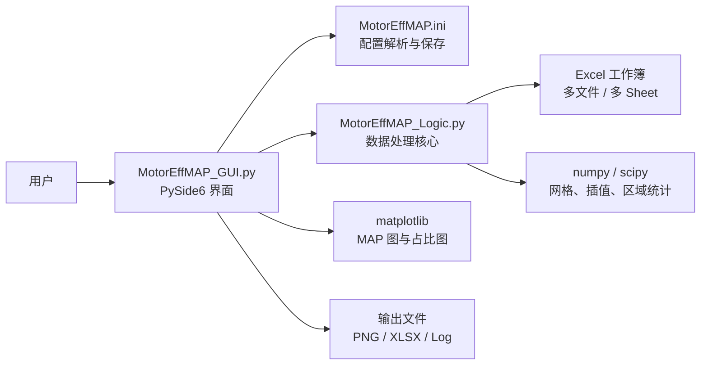

图 1 图解路线：

1. 入口层：用户只接触 GUI，完成选择文件、编辑配置、点击处理和查看结果。
2. 接口层：`MotorEffMAP.ini` 是用户和程序之间的稳定接口，保存列名、开关、网格和起始坐标。
3. 核心层：逻辑层只处理 DataFrame、包络线、插值和占比；GUI 负责 matplotlib 绘图和文件保存。

重点：新增功能时先判断属于 GUI、配置、逻辑还是输出，不能把绘图按钮逻辑塞进数据处理核心。

架构边界比较清晰：

- GUI 负责用户操作、配置编辑、进度、日志、可视化和文件保存。
- 逻辑层只负责从 DataFrame 到计算结果的转换，不直接操作 GUI 控件。
- 配置文件是用户可编辑接口，GUI 和逻辑层都通过配置字典读取参数。
- 打包脚本只负责构建和复制运行所需资源，不参与运行时计算。

核心模块的协作关系如下：

| 模块 | 输入 | 输出 | 失败处理 |
| --- | --- | --- | --- |
| `MainWindow` | 用户操作、INI 文件、Excel 路径 | GUI 状态、日志、PNG/XLSX 文件 | 捕获可预期 `ValueError`，弹窗提示并停止当前输出 |
| `MotorEffLogic` | 配置字典、当前 sheet 的 DataFrame | 清洗后的数据、包络线、插值网格、占比结果 | 返回 `last_error` 或抛出领域化错误 |
| `MotorEffMAP.ini` | 用户手动编辑或配置页保存 | 列名、开关、网格、绘图参数 | 读取兼容旧编码，写回统一为 UTF-8 BOM |
| `build_script.py` | 项目 venv、源码、版本文件、图标 | 版本化可执行文件夹 | 构建失败直接退出，构建后检查必要文件 |

## 4. 运行时数据流

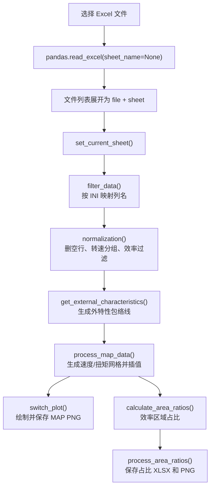

图 2 图解路线：

1. 展开输入：`pandas.read_excel(sheet_name=None)` 读取全部 sheet，GUI 展开为“文件 + sheet”条目。
2. 生成计算对象：每个 sheet 依次经过列映射、归一化、外特性、网格插值，得到 `XI/YI/ZI_Eff/ZI_Power/mask_valid_geo`。
3. 按开关输出：MAP 图和占比图由 INI 开关联动，关闭的类型不绘制、不保存、不显示旧图。

重点：点击“处理并保存所有”前必须读取最新 INI，保证配置页修改能影响实际输出。

处理流程由 `MainWindow.run_process_all()` 启动。程序会遍历用户选择的所有 Excel 文件，再遍历每个工作簿的所有 sheet。每个 sheet 都会按同一套配置处理。

运行时状态不是只保存在界面控件里，而是分布在 GUI 和逻辑层中：

| 状态 | 所在对象 | 说明 |
| --- | --- | --- |
| `config_dict` | `MainWindow` | 当前运行使用的扁平化配置。批处理和手动视图入口会重新读取 INI。 |
| `raw_config_obj` | `MainWindow` | 保留 INI 原始结构和注释，写回时尽量保持可读性。 |
| `all_results` | `MainWindow` | 文件列表中每个条目的文件路径、sheet 名和处理状态。 |
| `sheets_dict` | `MotorEffLogic` | 当前 Excel 文件的所有 sheet 数据。 |
| `raw_df` | `MotorEffLogic` | 当前 sheet 原始 DataFrame。 |
| `processed_df` | `MotorEffLogic` | 经过列映射、清洗、归一化后的数据，是后续计算唯一数据源。 |
| `f_edge_curve` | `MotorEffLogic` | 外特性包络线函数，用于限制网格几何区域。 |

## 5. GUI 层实现

### 5.1 主窗口

`MainWindow` 继承 `QMainWindow`，初始化时完成：

- 判断配置文件路径：
  - 源码运行：`run.py` 所在目录。
  - 编译版运行：`MotorEffMAP.exe` 所在目录。
- 初始化两个页签：
  - `处理与分析`：文件列表、批量处理按钮、视图切换按钮和绘图区。
  - `配置`：按 `MotorEffMAP.ini` 动态生成表单。
- 初始化日志区域和进度条。
- 调用 `reload_config()` 加载配置并创建 `MotorEffLogic`。

### 5.2 处理页

处理页左侧是操作区，右侧是绘图区：

| 控件 | 行为 |
| --- | --- |
| `选择数据文件` | 打开文件选择框，支持 `.xls` / `.xlsx`。 |
| 文件列表 | 每个 Excel 的每个 sheet 会展开成一个条目。 |
| `处理并保存所有` | 批量处理文件列表中所有条目。 |
| `MCU效率` / `电机效率` / `系统效率` | 对当前数据切换显示对应 MAP。 |
| `效率占比` | 对当前数据绘制效率区域占比曲线。 |

绘图区使用 `FigureCanvasQTAgg`，外层包裹 `AspectRatioWidget`，将屏幕显示保持在接近 25cm x 20cm 的长宽比例。

### 5.3 配置页

配置页读取 `MotorEffMAP.ini` 后动态生成表单。普通配置项使用 `QLineEdit`，`MCUMAP`、`MotorMAP`、`SYSMAP` 和三个占比开关使用 `QComboBox` 显示为 `开启` / `关闭`，写回时仍保存为 `1` / `0`。保存时：

1. 收集每个输入框的值。
2. 调用 `write_ini_file()` 写回配置。
3. 重新加载配置，让逻辑层立即使用新参数。

配置解析兼容两种形式：

- 没有 section 的传统 INI：程序会临时补 `[DEFAULT]` 再解析。
- 有 section 的标准 INI：按 section 读取，最终扁平化成配置字典。

编码读取顺序是：

1. 优先 UTF-8 with BOM / UTF-8。
2. UTF-8 失败后尝试 GB18030。

保存时统一使用 UTF-8 with BOM，保证 Windows 记事本和 VSCode 默认打开时都能正确显示中文。空值会写成 `key =`，避免 UI 保存制造行尾空白。

### 5.4 错误处理

GUI 层通过 `handle_processing_error()` 统一处理可预期的处理错误：

- 写入日志。
- 将进度条归零。
- 弹出 `QMessageBox.warning()`。
- 停止后续输出，避免生成半成品。

典型错误包括：

- Excel 缺失必要列。
- `SpeedGrid` 或 `TorqueGrid` 不是大于 0 的数字。
- 外特性包络线不可用。
- 网格规模超过安全上限。

## 6. 配置文件实现

`MotorEffMAP.ini` 是程序的主要用户接口。当前核心配置如下。

| 配置项 | 用途 | 示例 |
| --- | --- | --- |
| `VehicleCode` | 车型或项目代号，用于图标题和输出文件名。 | `KK` |
| `Speed` | Excel 中转速列名。 | `转速[rpm]` |
| `Torque` | Excel 中扭矩列名。 | `扭矩[Nm]` |
| `P_Motor` | Excel 中电机功率列名。 | `功率[kW]` |
| `Eff_MCU` | Excel 中控制器效率列名。 | `效1` |
| `Eff_Motor` | Excel 中电机效率列名。 | `效2` |
| `Eff_SYS` | Excel 中系统效率列名。 | `效3` |
| `U_dc` | Excel 中母线电压列名。 | `Udc4` |
| `customUdc` | 固定电压值。填写后优先使用该值，不再使用 `U_dc` 列。 | `530` |
| `MCUMAP` | 是否输出 MCU 效率 MAP。`1` 输出，`0` 不输出。 | `1` |
| `MotorMAP` | 是否输出电机效率 MAP。 | `1` |
| `SYSMAP` | 是否输出系统效率 MAP。 | `1` |
| `MCUAreaRatioCalculation` | 是否计算 MCU 效率区域占比。 | `1` |
| `MotorAreaRatioCalculation` | 是否计算电机效率区域占比。 | `1` |
| `SYSAreaRatioCalculation` | 是否计算系统效率区域占比。 | `1` |
| `EffMAPStep` | 效率等高线和占比阈值。支持逗号、分号或空格分隔。 | `80,85,90,95,99` |
| `PowerMAPStep` | 功率等高线值。 | `5,10,15,20` |
| `xstep` | 图中转速轴刻度间隔。 | `500` |
| `ystep` | 图中扭矩轴刻度间隔。 | `20` |
| `StartSpeed` | 效率区域统计起始转速。低于该值的区域屏蔽。 | `0` |
| `StartTorque` | 效率区域统计起始扭矩。低于该值的区域屏蔽。 | `0` |
| `SpeedGrid` | 插值网格的转速步长，必须大于 0。 | `5` |
| `TorqueGrid` | 插值网格的扭矩步长，必须大于 0。 | `0.5` |
| `MaxGridPoints` | 最大网格点数安全上限，限制 `网格行数 x 网格列数`，防止步长过小导致内存过大。 | `5000000` |
| `customSpeedDirection` | 自定义转向名称。留空时由转速均值自动判断；填写后覆盖自动判断结果。 | `正转` |
| `customMotionState` | 自定义工况状态。留空时由功率均值自动判断；填写后覆盖自动判断结果。 | `驱动` |

## 7. 输入 Excel 要求

程序使用 `pandas.read_excel(file_path, sheet_name=None)` 读取所有 sheet。每个 sheet 的第一行会作为列名。

输入数据建议满足：

- 第一行是列名，并且列名与 `MotorEffMAP.ini` 中配置完全一致。
- 转速、扭矩、功率、效率、电压列应能转换为数字。
- 可以存在空行，程序会在归一化阶段删除核心列为空的数据。
- 可以存在单位行或文本行，只要核心列无法转成数字，就会变成 NaN 并被删除。
- 同一 sheet 建议只包含同一转向、同一电动/发电状态、同一电压等级的数据。

基础必需列包括：

- `Speed`
- `Torque`
- `P_Motor`
- `U_dc`，除非填写了有效的 `customUdc`

效率列不是全局必需列。`Eff_MCU`、`Eff_Motor`、`Eff_SYS` 中只要至少有一个配置项填写并能匹配到 Excel 列，程序就可以继续；具体输出由对应的 MAP 开关和占比开关联动决定。缺失基础必需列或所有效率列都不可用时，程序会明确失败，不再用全 0 数据代替。

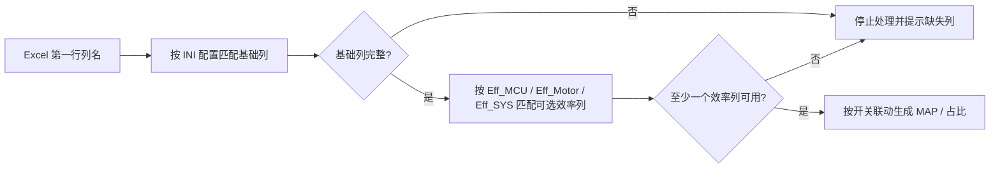

图 3 图解路线：

1. 先查基础列：`Speed`、`Torque`、`P_Motor` 和电压来源必须可用，否则没有坐标或功率，MAP 不能成立。
2. 再查效率列：`Eff_MCU`、`Eff_Motor`、`Eff_SYS` 按“配置项有值 + 对应开关开启”判断是否必需。
3. 最后决定输出：至少一个效率类型可用即可继续；不可用类型只跳过，不影响其它类型。

重点：可选效率列不能进入全局必填链，否则一个空配置会阻断其它正常图。

## 8. 逻辑层实现

### 8.1 数据加载

`MotorEffLogic.load_data()` 负责读取 Excel：

```python
self.sheets_dict = pd.read_excel(file_path, sheet_name=None)
```

返回结构是 `{sheet_name: DataFrame}`。GUI 会把每个 sheet 加入文件列表，处理时通过 `set_current_sheet(sheet_name)` 切换当前 DataFrame。

数据加载只负责把工作簿拆成多个 DataFrame，不做列名判断和数值清洗。这样做的原因是：同一个文件的不同 sheet 可能有不同数据质量问题，错误应定位到具体 sheet，而不是在读取文件时提前混在一起。

### 8.2 列映射和基础判断

`filter_data()` 根据配置读取列：

- 先去掉 Excel 列名首尾空格。
- 用 `pd.to_numeric(..., errors='coerce')` 将配置列转换为数字。
- 保留 NaN，不把空值填成 0。
- 对转速、扭矩、功率取绝对值。
- 效率和电压保留数值化结果。

```mermaid
flowchart TD
    A["raw_df：当前 sheet 原始数据"] --> B["清理列名首尾空格"]
    B --> C["读取 Speed / Torque / P_Motor"]
    B --> D["读取 customUdc 或 U_dc"]
    B --> E["按配置读取 Eff_MCU / Eff_Motor / Eff_SYS"]
    C --> F["原始转速均值判断转向"]
    C --> G["原始功率均值判断工况"]
    F --> H{"customSpeedDirection 有值?"}
    G --> I{"customMotionState 有值?"}
    H -- 是 --> J["使用自定义转向"]
    H -- 否 --> K["使用自动转向"]
    I -- 是 --> L["使用自定义工况"]
    I -- 否 --> M["使用自动工况"]
    D --> N["组合 processed_df"]
    E --> N
    J --> N
    K --> N
    L --> N
    M --> N
```

图 4 图解路线：

1. 读取配置列名：例如 `Speed = 转速`、`Eff_Motor = 电机效率`，先去掉空格和引号，再匹配 Excel 表头。
2. 转换为数值：使用 `pd.to_numeric(errors='coerce')`，无法转换的内容变成 NaN，而不是变成 0。
3. 判断方向和状态：默认根据原始转速和功率均值判断；`customSpeedDirection/customMotionState` 填写后覆盖自动判断。

重点：缺失值保留为 NaN 是为了让清洗阶段明确删除；伪造成 0 会污染包络线和面积占比。

方向和状态判断使用取绝对值之前的原始列均值：

| 判断项 | 规则 |
| --- | --- |
| 转向 | 转速均值 `> 0` 为 `正转`，否则为 `反转`。 |
| 状态 | 功率均值 `> 0` 为 `电动`，否则为 `发电`。 |

`customUdc` 有优先级：如果配置中填写了可转成数字的 `customUdc`，程序会创建同长度的常数电压序列；否则从 `U_dc` 列读取。

效率列的读取规则：

| 条件 | 行为 |
| --- | --- |
| 效率配置项为空 | 跳过该效率类型。 |
| 效率配置项有值且对应输出开关开启 | 该列必须存在，否则当前 sheet 处理失败。 |
| 效率配置项有值但对应输出开关关闭 | 尝试读取；读取失败只记录警告，不阻断其它输出。 |
| 三个效率列都不可用 | 当前 sheet 处理失败，因为没有任何 MAP 或占比可计算。 |

### 8.3 归一化

`normalization()` 做五件事：

1. 删除核心列中存在 NaN 的行。
2. 按转速排序。
3. 将相邻差值不超过 6 rpm 的转速合并为同一个平均转速。
4. 按转速和扭矩排序。
5. 过滤效率值，只保留 `[0, 100)` 范围内的数据。

该步骤会把结果写回 `self.processed_df`，后续包络线、插值和绘图都使用清洗后的数据。

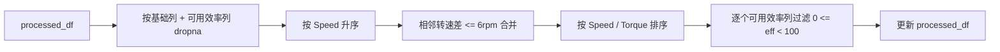

图 5 图解路线：

1. 删除核心空行：只按坐标、功率、电压和当前可用效率列删除 NaN，未配置效率列不参与清洗。
2. 合并转速层：相邻转速差小于阈值时归入同一层，避免外特性点因台架波动产生毛刺。
3. 过滤效率范围：效率必须满足 `0 <= eff < 100`，过滤后按 Speed/Torque 排序。

重点：归一化后的 `processed_df` 是包络线、插值和占比的唯一数据源。

转速合并的目的不是改变测试数据含义，而是把同一转速台架点附近的微小波动归为同一转速层。外特性包络线按转速分组取最大扭矩，如果不先合并，接近但不相等的转速会产生过密、抖动的包络线采样点。

### 8.4 外特性包络线

`get_external_characteristics()` 按转速分组，取每个转速下的最大扭矩，得到外特性点：

```python
max_curve = df.groupby('Speed')['Torque'].max().reset_index()
```

包络线插值策略：

| 外特性点数量 | 策略 |
| --- | --- |
| 0 | 包络线不可用，返回空结果。 |
| 1 | 使用常数扭矩曲线。 |
| 2 | 使用线性插值。 |
| 大于 2 | 使用 `PchipInterpolator` 保形插值。 |

插值结果会被限制在 `[0, 观测最大扭矩 * 1.05]`，防止平滑过冲导致网格异常变大。

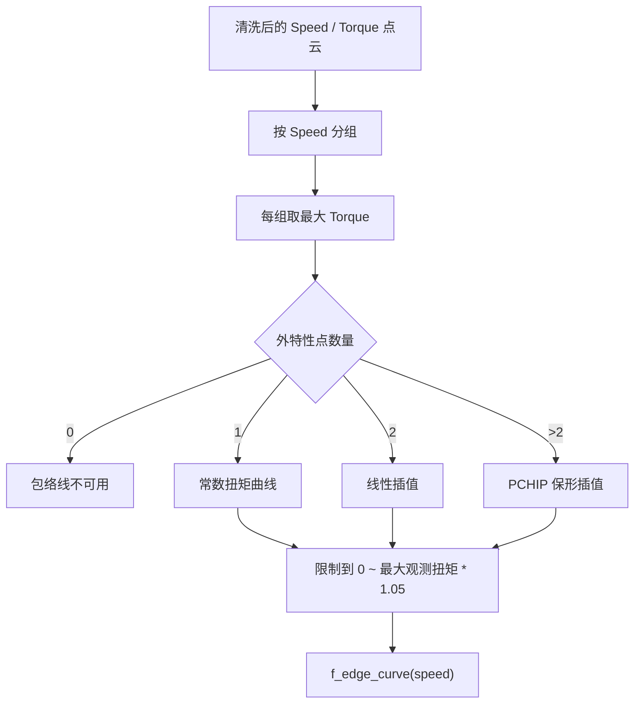

图 6 图解路线：

1. 按转速分组：清洗后的数据按 `Speed` 分组，每一组代表一个转速层。
2. 取最大扭矩：每个转速层取 `Torque.max()`，这些点构成外特性采样点。
3. 插值成连续边界：1 点用常数、2 点用线性、多点用 PCHIP，并裁剪到 `0 ~ 最大观测扭矩 * 1.05`。

重点：包络线不是效率等高线，它是“可运行区域上边界”；没有它，网格会扩展到物理上没有数据支撑的区域。

外特性包络线定义了后续网格的几何边界。程序不生成完整矩形网格后再裁剪，而是按每个转速列只生成包络线以内的扭矩点，这样占比分母更接近实际运行区域。

### 8.5 网格和插值

`process_map_data(eff_type)` 生成用于绘图和统计的二维网格。

转速轴：

```python
n_speed_steps = int(max_speed / SpeedGrid) + 1
xi_speed_axis = np.linspace(0, max_speed, n_speed_steps)
```

扭矩轴不是全矩形，而是按每个转速列生成：

1. 用外特性包络线计算当前转速的最大扭矩。
2. 从 `0` 到当前最大扭矩按 `TorqueGrid` 生成扭矩点。
3. 如果最后一点不是包络线边界，则额外追加边界点。
4. 用 NaN 填充不同列之间的长度差。

插值使用 scipy：

```python
ZI_Eff = griddata(points, eff_values, (XI_valid, YI_valid), method='linear')
ZI_Power = griddata(points, power_values, (XI_valid, YI_valid), method='linear')
```

`StartSpeed` 和 `StartTorque` 会生成截止掩码：

```python
cutoff_mask = (XI < StartSpeed) | (YI < StartTorque)
```

被截止的效率和功率会设为 NaN。

返回值是：

```python
XI, YI, ZI_Power, ZI_Eff, mask_valid_geo
```

其中 `mask_valid_geo` 表示外特性几何区域内、且不在起始转速/起始扭矩截止区内的点。

非矩形网格的形状可以理解为按列填充：

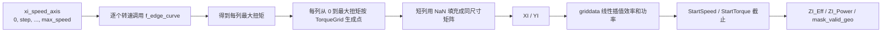

图 7 图解路线：

1. 生成转速轴：从 0 到最大转速按 `SpeedGrid` 建列，每一列对应一个固定转速。
2. 逐列生成扭矩点：用 `f_edge_curve(speed)` 得到该列最大扭矩，再从 0 到最大扭矩按 `TorqueGrid` 建点。
3. NaN 填充短列：不同列高度不同，短列空位填 NaN；NaN 是矩阵占位，不属于几何区域。

重点：`mask_valid_geo` 只标记包络线内且未截止的网格点，它才是面积占比分母。

变量含义如下：

| 变量 | 形状 | 含义 | 后续用途 |
| --- | --- | --- | --- |
| `points` | `N x 2` | 原始有效点的 `(Speed, Torque)` 坐标。 | `griddata` 插值输入坐标。 |
| `eff_values` | `N` | 当前效率类型的实测效率值。 | 插值得到 `ZI_Eff`。 |
| `power_values` | `N` | 电机功率实测值。 | 插值得到 `ZI_Power`，用于功率等高线。 |
| `XI` | `rows x cols` | 每个网格点的转速坐标。 | 绘图 X 坐标、起始转速截止。 |
| `YI` | `rows x cols` | 每个网格点的扭矩坐标；包络线外为 NaN。 | 绘图 Y 坐标、几何区域判断。 |
| `ZI_Eff` | `rows x cols` | 插值后的效率矩阵；不可插值或截止区域为 NaN。 | 效率填色、等高线、占比分子。 |
| `ZI_Power` | `rows x cols` | 插值后的功率矩阵。 | 功率等高线。 |
| `mask_valid_geo` | `rows x cols` | 包络线内且未被起始坐标屏蔽的几何区域。 | 效率占比分母。 |

插值前有三类保护：

| 保护 | 触发条件 | 结果 |
| --- | --- | --- |
| 点数保护 | 唯一 `(Speed, Torque)` 点少于 3 个。 | 抛出“有效点少于 3 个”的错误。 |
| 维度保护 | 点集秩小于 2，即所有点共线或退化。 | 抛出“点分布退化”的错误。 |
| 网格保护 | `max_rows * n_cols > MaxGridPoints`。 | 抛出“网格过大”，提示增大步长或检查包络线。 |

`StartSpeed` / `StartTorque` 同时影响显示区域和占比分母。示意如下：

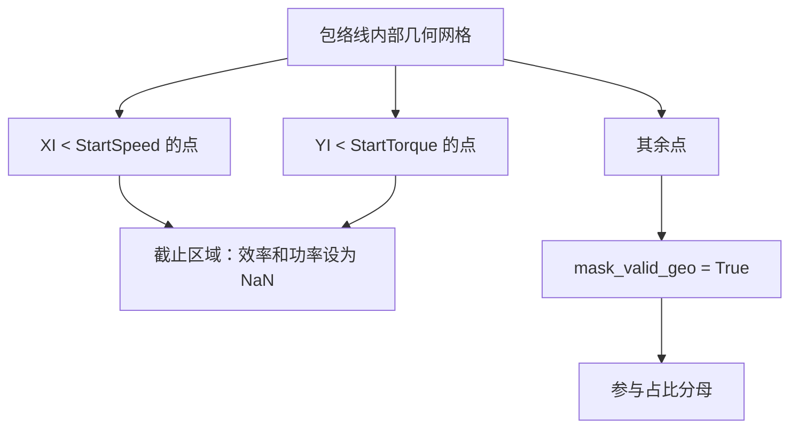

### 8.6 效率区域占比

`calculate_area_ratios(z_eff, geo_mask)` 根据 `EffMAPStep` 计算各效率阈值的面积占比。

分母规则：

- 如果提供 `geo_mask`，分母使用几何区域总点数。
- 如果没有 `geo_mask`，分母使用 `z_eff` 中非 NaN 点数。

当前 GUI 使用 `process_map_data()` 返回的 `mask_valid_geo`，因此效率区域占比的分母从配置的几何运行区域开始计算。默认 `StartSpeed=0`、`StartTorque=0` 时，即从 `0rpm / 0Nm` 开始。

分子规则：

- 对每个效率阈值，统计 `z_eff >= level` 的点数。
- NaN 不会计入分子。

公式：

```text
Ratio(level) = count((ZI_Eff >= level) & mask_valid_geo) / count(mask_valid_geo) * 100
```

图形化理解：

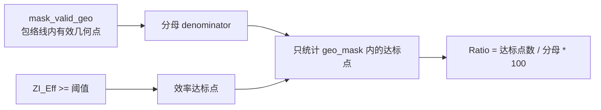

图 8 图解路线：

1. 先定分母：`denominator = count(mask_valid_geo)`，表示包络线内、起始坐标以上的几何网格点。
2. 再定分子：`count((ZI_Eff >= level) & mask_valid_geo)`，只有几何区域内达标的效率点才算分子。
3. 最后算百分比：`Ratio = 分子 / 分母 * 100`，每个 `EffMAPStep` 阈值都重复一次。

重点：分母不用“插值成功点数”，而用几何运行区域；这样凸包外无法插值的区域不会把占比虚高。

这里的分母是几何运行区域，不是 `griddata` 能成功插值的点数。这样做的结果是：凸包外但仍处于包络线内的区域会计入分母，若无法插值得到效率值，则不会计入分子。这比只按非 NaN 插值点做分母更保守，避免插值失败区域被自动排除后把占比抬高。

### 8.7 核心算法原理图

本节用几何示意补充第 8 章的流程图。HTML 版在同一章节提供内嵌 SVG 原理图；Markdown 版保留程序可读的简化坐标图、公式和说明。

#### 8.7.1 非矩形运行区域

效率 MAP 的有效统计区域不是完整矩形，而是外特性包络线以内的非矩形区域：

```text
Torque
  ^
  |                  外特性包络线
  |              .----------------.
  |          .--'                  '---.
  |      .--'                          |
  |  .--'                              |
  |  |#################################|  # = 包络线内几何运行区域
  |  |#################################|
  |  |#################################|
  +--+--------------------------------------> Speed
     0
```

程序逐个转速列生成从 `0` 到当前包络线扭矩上限的网格点。不同转速列高度不同，短列用 NaN 填充只是为了让矩阵形状一致；NaN 填充区不属于几何运行区域。

图 9 图解路线：

1. 矩形区域只是画布：最大转速和最大扭矩只能定义坐标范围，右上角很多点并不是可运行点。
2. 包络线给出上边界：每个转速的最大扭矩不同，包络线以下才是可以参与统计的几何区域。
3. 网格点代表面积：程序用网格点计数近似面积；网格越细越接近连续面积，但计算量越大。

重点：`SpeedGrid/TorqueGrid` 是面积近似精度和运行速度之间的平衡，不是随便越小越好。

#### 8.7.2 面积占比分母和分子

以 `90%` 效率阈值为例，面积占比可以理解为“高效区域”除以“全部可运行区域”：

```text
Torque
  ^
  |                包络线内几何区域（分母）
  |           .--------------------------.
  |       .--'        +++++++++++++       '---.
  |   .--'           +  >=90% 区域 +          |
  |   |              +   （分子）  +          |
  |   |#######################################|
  |   |#######################################|
  +---+--------------------------------------------> Speed
      0

Ratio(90) = count((ZI_Eff >= 90) & mask_valid_geo)
          / count(mask_valid_geo) * 100
```

关键点：

- 分母：`count(mask_valid_geo)`，即包络线内且未被起始坐标截止的几何网格点。
- 分子：`count((ZI_Eff >= level) & mask_valid_geo)`，即几何区域内达到阈值的点。
- `ZI_Eff` 为 NaN 的点不会计入分子；如果它仍在几何区域内，则会计入分母。

图 10 图解路线：

1. 底图是几何运行区域：包络线内的全部有效网格点构成分母，起始坐标以下的点已经被剔除。
2. 叠加达标区域：在底图内检查 `ZI_Eff >= 90`，达标点构成分子，不达标点只留在分母中。
3. 多个阈值形成曲线：80、85、90、95、99 等阈值分别计算，阈值越高占比通常越低。

记忆口径：先圈定“能运行的地盘”，再数“达到阈值的地盘”，最后相除。

#### 8.7.3 起始坐标截止区域

`StartSpeed` 和 `StartTorque` 同时影响图形显示区域和占比分母。低于起始转速或起始扭矩的点会被截止：

```text
Torque
  ^
  |           保留区域：参与显示和占比分母
  |        .------------------------------.
  |    .--'                               |
  |    |                                  |
  |----+----------------------------------|  StartTorque
  |////|//////////////////////////////////|  低扭矩截止区
  |////|                                  |
  +----+--------------------------------------> Speed
       |
       StartSpeed

左侧低转速区：XI < StartSpeed
底部低扭矩区：YI < StartTorque
cutoff_mask = (XI < StartSpeed) | (YI < StartTorque)
```

被 `cutoff_mask` 命中的区域会把 `ZI_Eff` 和 `ZI_Power` 设为 NaN，同时不再计入 `mask_valid_geo`。因此用户把 `StartSpeed=50`、`StartTorque=5` 时，图形显示起点和占比分母都会从这个坐标开始。

图 11 图解路线：

1. 生成截止掩码：`cutoff_mask = (XI < StartSpeed) | (YI < StartTorque)`，低转速或低扭矩任一条件命中都截止。
2. 屏蔽图形矩阵：截止区域的 `ZI_Eff` 和 `ZI_Power` 设为 NaN，因此 MAP 图不会显示这部分。
3. 同步调整分母：`mask_valid_geo = 包络线内 & ~cutoff_mask`，占比只按保留区域统计。

重点：如果设置 `StartSpeed=50`、`StartTorque=5`，图形起点和占比分母都会从这个坐标开始。

### 8.8 逻辑层边界情况

| 场景 | 当前处理 |
| --- | --- |
| Excel 尾部空行 | 数值化后为 NaN，在 `normalization()` 中删除。 |
| 基础列缺失 | `filter_data()` 记录 `last_error` 并返回失败。 |
| 某个效率列未填写 | 对应效率类型不可用，不影响其它已配置效率类型。 |
| 输出开关关闭 | GUI 不绘制、不保存对应 MAP 或占比。 |
| `customUdc` 非数字 | 记录警告，回退到 `U_dc` 列。 |
| 有效点少于 3 个 | 不调用 `griddata`，直接抛出可读错误。 |
| 有效点共线 | 不调用 `griddata`，直接抛出可读错误。 |
| `SpeedGrid` / `TorqueGrid` 非正数 | 抛出配置错误。 |
| 网格超过 `MaxGridPoints` | 抛出配置错误，避免创建过大数组。 |
| `geo_mask` 与效率矩阵形状不一致 | 占比计算抛出错误，避免错误分母。 |

## 9. 绘图实现

### 9.1 MAP 图

`switch_plot(eff_type_short, save_png=False)` 负责绘制 MCU、电机或系统效率 MAP。

绘图内容：

- 效率填色等高线：`contourf(..., cmap='jet')`
- 效率等高线标签：黑色线条。
- 功率等高线标签：绿色线条。
- 轴标签：
  - X：`转速 [rpm]`
  - Y：`扭矩 [N.m]`
- 标题格式：
  - `{VehicleCode}-{电压}V-{转向}{状态}-{MAP名称}`

状态命名规则：

- 逻辑层返回 `电动` 时，图和文件名中显示为 `驱动`。
- 逻辑层返回 `发电` 时，保持 `发电`。

保存图片时，程序临时设置图像尺寸约为 25cm x 20cm，DPI 为 200，保存后恢复 GUI 显示尺寸。

MAP 图显示和保存共用同一组版式参数：

| 参数 | 当前口径 |
| --- | --- |
| 图像比例 | 约 `25cm x 20cm`，对应 `9.84 x 7.87` 英寸。 |
| GUI 显示容器 | 使用与导出图一致的长宽比例。 |
| 边距 | 通过 `apply_figure_layout()` 统一设置。 |
| 坐标起点 | 从 `StartSpeed` / `StartTorque` 开始显示。 |
| 保存 DPI | `200`。 |

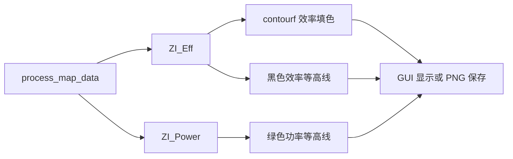

图 12 图解路线：

1. 底层是效率填色：`contourf(XI, YI, ZI_Eff)` 生成效率色块，NaN 区域不着色。
2. 中层是等高线：黑色线表示效率等级，绿色线表示功率等级，标签会做重叠过滤。
3. 输出分为显示和保存：GUI 显示和 PNG 保存共用比例常量；保存使用固定尺寸和 200 DPI。

重点：界面图和保存图必须共享长宽比与边距，否则会出现“保存正常、界面变形”的问题。

### 9.2 效率区域占比图

`process_area_ratios()` 会同时保存 Excel 和 PNG。`show_ratio_plot()` 只负责在 GUI 中显示当前数据的占比图。

占比图内容：

- X 轴：效率阈值，范围 80 到 100。
- Y 轴：效率区域占比，范围 0 到 100。
- MCU：蓝色星标线。
- 电机：绿色圆点线。
- 系统：洋红色加号线。

占比图的保存和显示共用 `_plot_ratio_on_axes()`，数据来源共用 `_collect_ratio_data()`。因此手动点击“效率占比”和批处理保存 PNG 使用同一套开关判断、同一套比例、同一套曲线样式。

## 10. 输出文件

输出文件名由 `build_output_stem()` 构造，包含：

- 源 Excel 文件名。
- sheet 名称。
- `VehicleCode`。
- 平均电压。
- 转向。
- 状态。
- 输出类型。

示例：

```text
示例数据_Sheet1_车型A-500V-正转驱动_MCUEfficiencyMAP.png
示例数据_Sheet1_车型A-500V-正转驱动_效率占比.xlsx
示例数据_Sheet1_车型A-500V-正转驱动_效率占比.png
```

文件名会做清理：

- 保留中文、字母、数字、下划线、点和短横线。
- 其他字符替换为下划线。
- 连续下划线会折叠。

输出命名图解路线：

1. 来源字段：源 Excel 名称和 sheet 名称标识数据来源；`VehicleCode`、平均电压、转向和工况标识测试条件。
2. 输出类型：MAP 图追加 `MCU/Motor/System EfficiencyMAP`，占比结果追加 `效率占比.xlsx/png`。
3. 文件名清理：保留中文、字母、数字、下划线、点和短横线，其它字符替换为下划线并折叠连续下划线。

重点：README 和 docs 只能写匿名示例，例如“示例数据”和“车型A”，不能出现真实文件名、项目代号或电压平台。

## 11. 编译版实现

打包入口有两个：

```text
build_exe.bat
build_script.py
```

`build_exe.bat` 负责：

1. 切换到脚本所在目录。
2. 如果存在 `venv\Scripts\activate.bat`，自动激活虚拟环境。
3. 检查 Python 是否可用。
4. 调用 `python build_script.py`。

`build_script.py` 负责：

1. 强制使用项目虚拟环境 `venv\Scripts\python.exe`。如果从其它 Python 启动，会自动转调用项目 venv。
2. 检查并安装 `pyinstaller`。
3. 使用已有 `MotorEffMAP.ico`；缺失时使用默认图标，不再从 PNG 转换图标。
4. 清理旧的 `build/`、`dist/` 和 `MotorEffMAP.spec`。
5. 调用 PyInstaller：

```text
python -m PyInstaller --noconfirm --onedir --windowed --name MotorEffMAP --clean run.py
```

6. 根据 `version.ini` 读取版本标签，将默认输出目录重命名为 `MotorEffMAP_YYYYMMDD-Vx.y`。
7. 将 `MotorEffMAP.ini`、`version.ini` 和 `MotorEffMAP.ico` 复制到发布目录。
8. 清理当前程序不用的 Qt QML/Quick/PDF/VirtualKeyboard 和翻译资源。
9. 检查 `MotorEffMAP.exe`、`MotorEffMAP.ini`、`version.ini` 是否存在。
10. 输出总体积和最大文件列表。

最终运行目录：

```text
dist/MotorEffMAP_20260611-V1.2/
├── MotorEffMAP.exe
├── MotorEffMAP.ini
├── version.ini
└── MotorEffMAP.ico
```

编译版运行时，程序会从 `MotorEffMAP.exe` 同级目录读取 `MotorEffMAP.ini`。

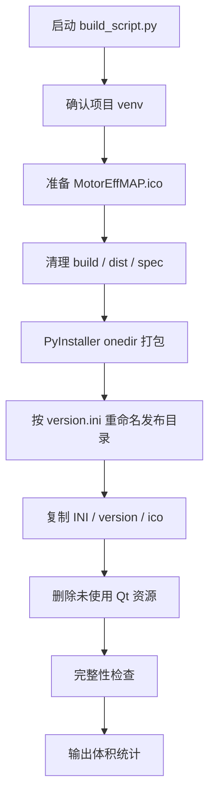

图 13 图解路线：

1. 确认构建环境：`build_script.py` 强制使用 `venv\Scripts\python.exe`，避免全局 Python 把无关大型库打进发布包。
2. 执行 PyInstaller：使用现有 `MotorEffMAP.ico`，不再每次转换图标；生成 onedir 目录后按版本重命名。
3. 复制和检查资源：复制 `MotorEffMAP.ini`、`version.ini`、图标，检查 exe、配置和版本文件是否存在，并输出体积统计。

重点：发布目录名称来自 `version.ini`，格式类似 `MotorEffMAP_20260611-V1.2`。

## 12. 日志和排错

程序运行日志写入：

```text
MotorEffMAP.log
```

GUI 底部也会显示实时日志。常见问题如下。

| 现象 | 常见原因 | 处理 |
| --- | --- | --- |
| 提示找不到列 | `MotorEffMAP.ini` 中列名与 Excel 第一行不一致。 | 修改配置，使列名完全一致。 |
| 提示 `SpeedGrid` 必须大于 0 | 网格步长为空、0、负数或非数字。 | 设置为正数，例如 `5`。 |
| 提示网格过大 | `SpeedGrid` / `TorqueGrid` 太小，或包络线异常。 | 增大网格步长，检查数据。 |
| 图为空或占比为空 | 有效数据被全部过滤，或效率列无法转换为数字。 | 检查 Excel 数据和配置列名。 |
| 编译版找不到配置 | `MotorEffMAP.ini` 不在 exe 同级目录。 | 把配置文件放到 `MotorEffMAP.exe` 同目录。 |
| 中文乱码 | 文件不是 UTF-8 BOM，或被旧编辑器另存为其它编码。 | 用程序配置页保存一次，或用 VSCode 转为 UTF-8 with BOM。 |
| 关闭了 MAP 但界面仍旧显示 | 旧版本曾有入口绕过开关；当前版本手动视图会重新读取 INI。 | 确认保存并重载配置，必要时重启程序。 |
| 构建包体积明显变大 | PyInstaller 可能使用了全局 Python 环境或误收集大型库。 | 确认日志中的 Python environment 为项目 `venv`。 |

## 13. 维护注意事项

- 不要把空数据填成 0。空行应保留为 NaN，再按核心列删除。
- 不要把缺失列静默替换为全 0。缺失列必须明确失败。
- 面积占比分母按几何运行区域计算，默认从 `0rpm / 0Nm` 开始。
- GUI 调用逻辑层时必须捕获可预期的 `ValueError`，并转成用户提示。
- 修改 `docs/program-implementation.md` 后，应同步修改 `docs/program-implementation.html`。
- 修改配置字段时，应同步更新 `README.md` 和本文档配置表。

维护检查清单：

| 修改类型 | 必查文件 | 必跑验证 |
| --- | --- | --- |
| 新增或删除配置项 | `MotorEffMAP.ini`、`MotorEffMAP_GUI.py`、README、本文档 | 配置页保存、`git diff --check` |
| 修改数据清洗或插值 | `MotorEffMAP_Logic.py`、测试、本文档第 8 章 | 单元测试、目标 Excel 回归样本 |
| 修改图形版式 | `MotorEffMAP_GUI.py`、本文档第 9 章 | GUI 显示比例、保存 PNG 比例 |
| 修改打包流程 | `build_script.py`、`build_exe.bat`、README、本文档第 11 章 | 构建、exe 启动烟测、体积统计 |
| 修改输出命名 | `build_output_stem()`、README、本文档第 10 章 | 文件名匿名示例检查、非法字符测试 |
